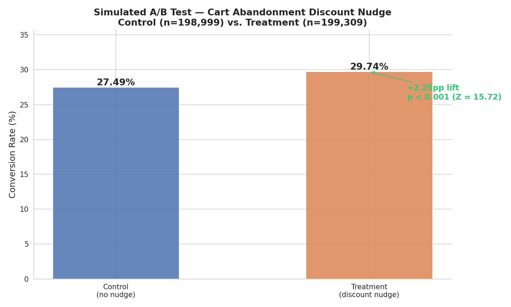
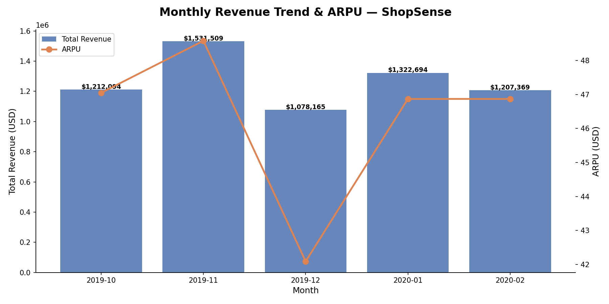
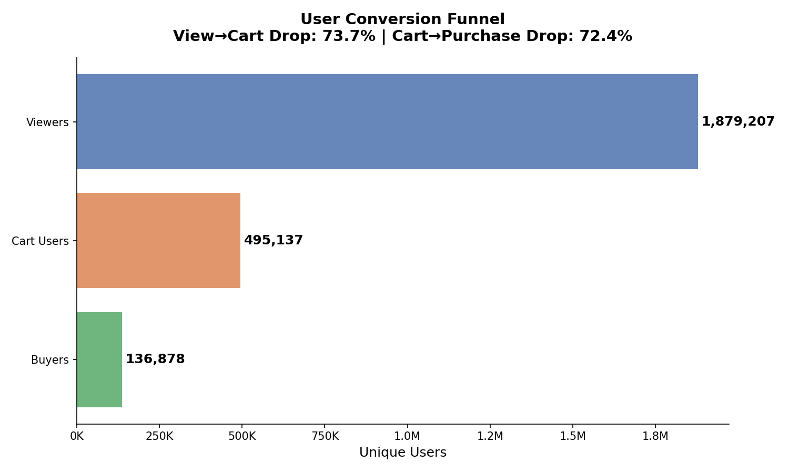
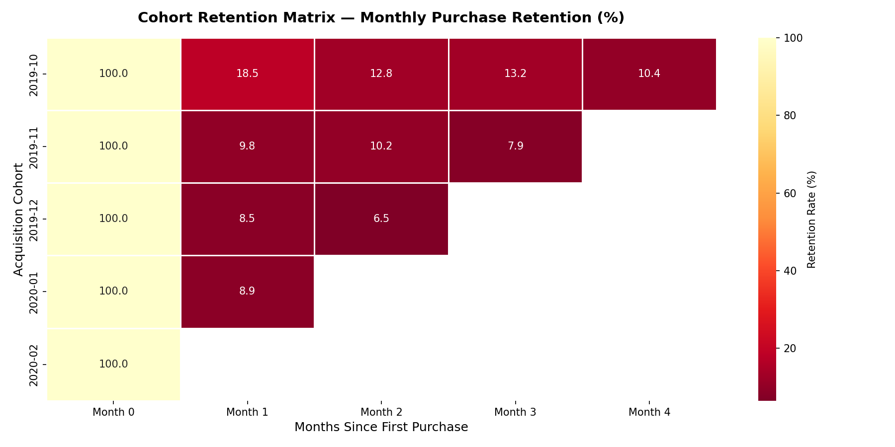
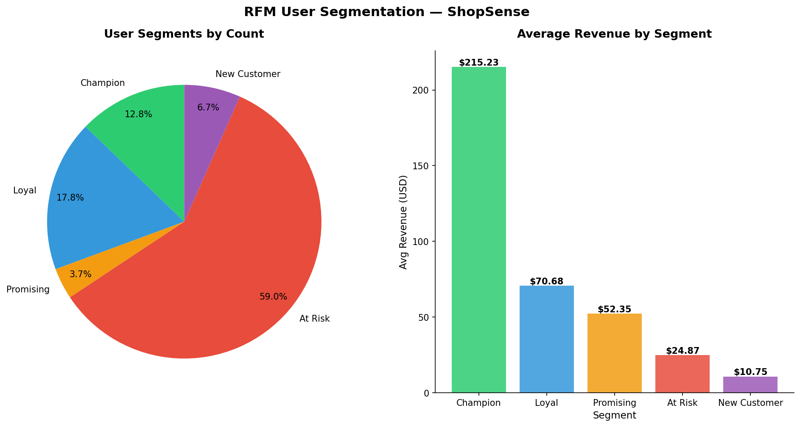
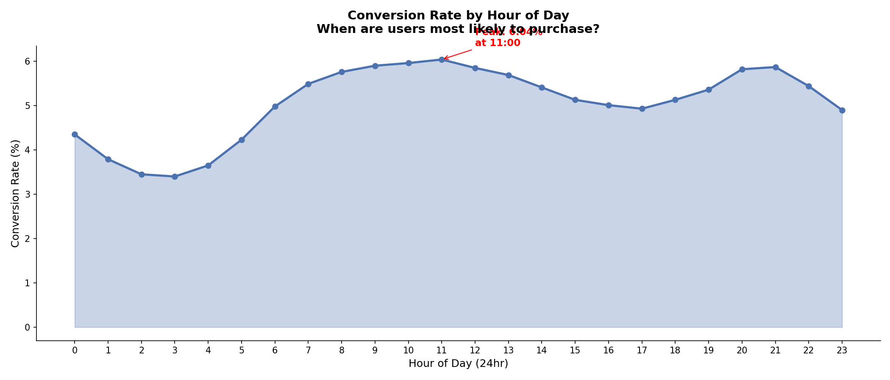
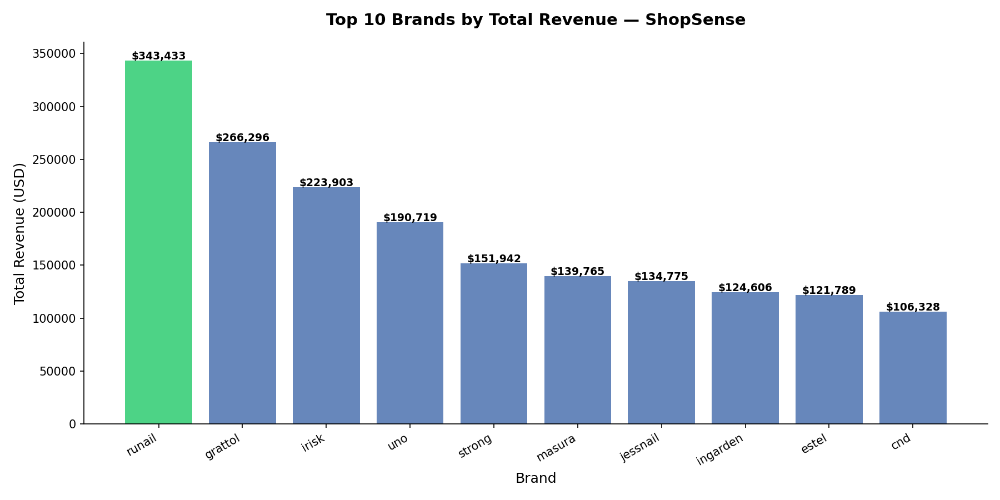

# 🛍️ ShopSense Product Analytics


## 📌 Business Context

ShopSense is a D2C cosmetics e-commerce store — a portfolio case built on a
**public GA4-style ecommerce events dataset (~20.7M rows)**. As a Product Analyst,
I investigated why users drop off between **product view and first purchase**, and
why retention is low after the first order. *(All revenue figures are in USD, as
per the source dataset.)*

## ❓ Business Questions Answered

1. Where exactly are users dropping off in the purchase funnel?
2. What is our Day 1, Day 7, and Day 30 retention rate?
3. Which monthly user cohorts generate the most revenue?
4. What is the Monthly Active User (MAU) trend over 5 months?
5. What is the Average Revenue Per User (ARPU)?
6. Which product categories drive the most conversions?

## 🔑 Key Findings (TL;DR)

> Full write-up in [`reports/executive_summary.md`](reports/executive_summary.md).

- **The funnel leaks at the top, not at checkout.** Only **24.9%** of viewers add to cart and just **6.9%** ever purchase — the biggest loss is awareness→intent.
- **Cart abandonment is the #1 revenue leak.** **72.5%** of users who add to cart never buy.
- **Retention is acquisition-dependent.** The Oct-2019 cohort retained at **18.5%** in Month 1 — nearly 2× every later cohort, pointing to a one-off acquisition spike and no durable retention engine.
- **Revenue is promotion-driven and volatile.** Month-over-month swing from **+26%** (Nov) to **−29.6%** (Dec).
- **Value is highly concentrated.** **14,139 "Champion" users (13% of buyers)** average **$215** each, while **59% of buyers are "At Risk."**
- **Best conversion window is 9 AM–1 PM** (~6% vs ~3.5% overnight) — a free lever for promo timing.

**Scale:** 20.7M events · 1.6M users · 110,518 buyers · $6.35M revenue · ARPU $57.47.

| Recommendation | Expected Impact |
|----------------|-----------------|
| Cart-abandonment retargeting within 2 hrs | Recover the largest near-term revenue pool |
| Win-back campaign for 65K At-Risk users | Protect existing revenue base |
| Investigate December revenue drop | Fix seasonality / campaign gap |
| Schedule promos for the 9 AM–1 PM peak | Lift conversion at zero cost |

## 🎯 North Star Metric

> Full write-up in [`reports/north_star_metric.md`](reports/north_star_metric.md).

**Core Revenue** — revenue from users *not* in the "At Risk" segment —
is **$4.73M, 74.5%** of total revenue, vs. $1.62M (25.5%) from the
65,234 At-Risk users least likely to buy again. Tracking this alongside
total revenue catches growth that's really just one-time, at-risk
buyers rather than a durable customer base.

## 🧪 A/B Test (Simulated)

> Full write-up in [`reports/ab_test_simulation.md`](reports/ab_test_simulation.md).

Designed and analyzed a simulated A/B test for a cart-abandonment discount nudge,
since the underlying dataset is observational (no real experiment exists).

| Metric | Value |
|---|---|
| Baseline conversion | 27.52% |
| Target (MDE +3pp) | 30.52% |
| Required sample/group | 2,828 (398K available) |
| Observed lift | +2.25pp (27.49% → 29.74%), **+8.2% relative** |
| 95% CI on lift | [1.97pp, 2.53pp] |
| Significance | p < 0.001 (Z = 15.72) — statistically **and** practically significant (CI clears a >1pp action bar) |

**Note:** Simulated on real abandoner data to demonstrate methodology — not causal proof.



## 📐 Statistical Rigor — Beyond the A/B Test

Two follow-up analyses that test whether the descriptive findings above
hold up statistically, not just visually.

**Funnel drop-off significance** — full write-up in
[`reports/funnel_significance.md`](reports/funnel_significance.md).
Every funnel stage (view-to-cart, cart-to-purchase, overall conversion)
varies significantly by month (chi-square, p < 0.001 on all three) — the
month-to-month swings are real, not noise. At this sample size
(350K+ viewers/month) that's close to guaranteed, so the report leads
with the caveat: statistical significance isn't the interesting
question here, effect size is.

**Segment-level cart abandonment — Champions vs. At-Risk** — full
write-up in [`reports/segment_lift_analysis.md`](reports/segment_lift_analysis.md).

| Segment | Abandonment Rate | Total Carts |
|---|---|---|
| Champion | 62.04% | 1,493,513 |
| At Risk | 64.54% | 1,122,022 |
| Loyal | 64.06% | 763,856 |

Champion vs. At-Risk gap: **2.50pp, 95% CI [2.38pp, 2.62pp], p < 0.001**
(real, measured data — not simulated, and a single comparison chosen in
advance, not the best result out of many pairs tested). The
counter-intuitive finding: your highest-value repeat buyers abandon
carts at nearly the same rate as your least-engaged segment. Segment
isn't a strong lever on abandonment rate, but it is on *volume*:
Champions + At-Risk together hold ~1.65M of the ~2.18M total
abandoned-cart instances.

## 🧪 Experiment Ideas

> Full write-up in [`reports/experiment_ideas.md`](reports/experiment_ideas.md).

Three follow-up experiments beyond the cart-abandonment nudge already
tested: an **At-Risk win-back email** (targeting the 65,234 At-Risk
users), a **promo timing shift** to the 9 AM–1 PM peak window, and a
**diagnostic deep-dive** into the December revenue drop's root cause.

## 🛠️ Technical Challenges Solved

> Full write-up in [`reports/technical_challenges.md`](reports/technical_challenges.md).

Three engineering decisions worth knowing about: **chunked loading**
(100K rows at a time) to keep memory flat while ingesting 20.7M rows,
**NULL-handling** for two columns that were 42-98% empty (`category_id`
fallback + `'unknown'` brand label instead of dropping the columns),
and **targeted indexes** on `event_type`/`user_id`/`event_time` so the
funnel and cohort queries don't fall back to full table scans.

## 🛠️ Tools & Technologies

| Tool | Purpose |
|------|---------|
| MySQL 8.0 | Data storage and SQL analysis |
| Python 3.11 | Data cleaning, EDA, A/B test analysis |
| Pandas / Seaborn / Matplotlib | Analysis and visualization |
| statsmodels | Power analysis and significance testing |
| Power BI | Executive dashboard |
| Git + GitHub | Version control and portfolio |

## ▶️ How to Run

1. Create a MySQL 8.0 database named `shopsense` and set your credentials as
   environment variables (never hardcode them):
   ```
   export DB_HOST=127.0.0.1
   export DB_USER=root
   export DB_PASSWORD=your_password
   export DB_NAME=shopsense
   ```
2. Install dependencies: `pip install -r requirements.txt`
3. Download the raw CSVs into `data/raw/` (see [`data/README.md`](data/README.md) for source)
4. Run the schema + analysis SQL in `sql/` (in numbered order), then the
   notebooks in `notebooks/` (in numbered order) to load data, explore, export
   for Power BI, and reproduce the A/B test.

## 📁 Project Structure

```
shopsense-product-analytics/
│
├── data/
│   ├── raw/                ← Original datasets (not uploaded)
│   └── cleaned/            ← Processed datasets (not uploaded)
│
├── sql/
│   ├── schema/             ← Table creation scripts
│   ├── analysis/           ← Funnel, retention, cohort queries
│   └── kpis/               ← KPI metric queries
│
├── notebooks/              ← Python EDA + A/B test scripts
│   └── statistical_tests/  ← Funnel + segment significance testing
│
├── dashboards/
│   └── screenshots/        ← Power BI dashboard + chart exports
│
├── reports/                ← Final summary reports
│
├── docs/
│   ├── kpi_definitions.md  ← All KPI definitions
│   └── business_questions.md ← Business questions tracker
│
├── requirements.txt        ← Python dependencies
└── LICENSE                 ← MIT License
```

## 📊 Key KPIs Tracked

| KPI | Definition | Value Found |
|-----|-----------|-------------|
| DAU / WAU / MAU | Daily / Weekly / Monthly Active Users | ~18.5K/day · ~104.8K/week · 368K–410K/month |
| DAU/MAU (Stickiness) | How often monthly users return daily | ~4.8% |
| Retention Rate | % of users returning on Day 1, 7, 30 | 1.12% / 4.16% / 11.95% |
| Conversion Rate | % of viewers who completed a purchase | 6.92% |
| ARPU | Average Revenue Per User | $57.47 |
| Funnel Drop-off Rate | % lost at each funnel stage | 72.48% cart abandonment |

> Full breakdown, formulas, and data-quality notes in
> [`docs/kpi_definitions.md`](docs/kpi_definitions.md).

## 📈 Dataset

- **Source:** Public GA4-style ecommerce behavioral events (cosmetics retailer), framed here as the "ShopSense" D2C case
- **Size:** ~20.7 million events across 5 months (Oct 2019 – Feb 2020)
- **Events:** `view` → `cart` → `remove_from_cart` → `purchase`
- **Currency:** USD (as per source data)

## ⚠️ Limitations

- **5 months only.** Longer-term retention curves (Month 6+) can't be
  confirmed with this window — the cohort/retention findings are
  directional, not a full-lifecycle view.
- **Observational, not causal.** No real experiment was run on this
  dataset; the A/B test is a simulation demonstrating methodology, and
  the funnel/segment findings are correlational.
- **Cart abandonment is a lifetime-count proxy**, not a session-level
  flag — this dataset doesn't reliably link one specific cart event to
  one specific purchase, so "abandoned instances" means "cart adds
  beyond what a user ultimately checked out," not a per-session flag.
- **Small-sample brand figures** (e.g. top-converting brands like
  eunyul) should be treated as signals to investigate further, not
  proven patterns — see `docs/kpi_definitions.md` for sample sizes.
- **The Champion vs. At-Risk segment comparison was pre-specified**,
  not the best result cherry-picked from all 10 possible segment pairs
  — stated explicitly here since that distinction matters for how much
  to trust the p-value.

## 📸 Key Visualizations

### Monthly Revenue Trend


### Conversion Funnel


### Cohort Retention Heatmap


### User Segmentation


### Hourly Conversion Rate


### Top Brands by Revenue

---

**Brijesh Vaghela** · [LinkedIn](https://www.linkedin.com/in/brijesh-vaghela) · [GitHub](https://github.com/Brijesh403)